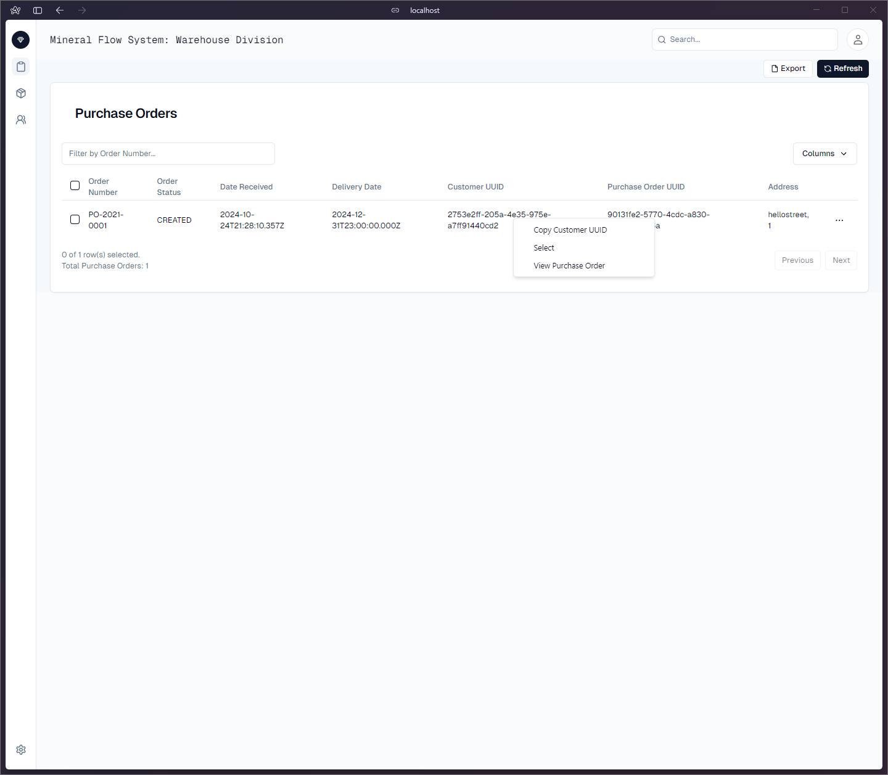

# MineralFlowSystem

MineralFlowSystem is a comprehensive logistics and warehouse management system tailored to streamline the movement, storage, and distribution of raw materials such as gypsum, iron ore, cement, petcoke, and slag. The system is designed to provide efficient management of the mineral supply chain from order creation to final delivery, ensuring seamless operations for warehousing, shipping, and invoicing.

## Key Features

- **Purchase Order Management**: Create, track, and manage purchase orders for raw materials from suppliers, ensuring accurate quantities and pricing.
- **Shipping and Transportation Coordination**: Automate the scheduling of trucks and ships for material pick-up and delivery, complete with appointment-based arrival slots for trucks at the warehouse.
- **Warehouse Operations**: Manage inventory in real-time, including receiving, inspection, and storage of materials. Ensure that stock levels are accurate and materials are stored appropriately for future use or dispatch.
- **Inventory Tracking**: Maintain a detailed overview of materials stored in the warehouse, ensuring up-to-date records of available stock.
- **Invoicing and Financial Management**: Handle the financial aspects of material storage, including storage fees, purchase order reconciliation, and invoicing for customer orders.
- **Truck Scheduling and Dock Management**: Coordinate and streamline the flow of trucks into and out of the warehouse, avoiding bottlenecks and ensuring timely delivery.

## System Workflow

1. **Purchase Orders** are created to source raw materials from suppliers.
2. **Shipping Orders** are triggered, scheduling transportation via trucks or ships.
3. **Truck Appointments** are booked for warehouse delivery, ensuring efficient unloading.
4. **Warehouse Reception** manages unloading, quality inspection, and reconciliation of incoming materials.
5. **Inventory** is updated in real-time to track stock levels and material availability.
6. **Storage Fees** and invoicing are processed as materials are received and stored.
7. **Dispatch** of materials is coordinated for customer orders, either for direct shipment or held in storage.

## Bounded Contexts

- **Warehousing Context**: Manages stock levels, storage capacity, and material types.
- **Landside Context**: Handles truck appointments, deliveries, and weighing processes.
- **Waterside Context**: Manages ship docking, inspection, and loading operations.
- **Invoicing Context**: Automates the calculation of storage fees and commission-based pricing.

## Technologies

- **Backend**: Written in Java using hexagonal architecture, powers robust APIs for handling logistics operations, inventory, and invoicing.
- **Frontend**: A responsive React-based dashboard for warehouse and site managers to monitor inventory, truck schedules, and shipment statuses. Project can be found [here](https://github.com/pashioya/mineral-flow-system-frontend)
- **Database**: Real-time data storage and tracking using SQL databases, ensuring accuracy in material flow.
- **Integration**: Seamless integration with third-party shipping and invoicing systems.

## Progress Reports

## 1: Project Kickoff
- **Date**: 2024-10-025
- **Progress**: The Warehouse Bounded context has advanced alot. Specifically with the management of storage capacities as well as its management of current orders. The Landside context is being developed to a point where truck appointments can be made and managed. The Waterside context is still in its infancy but has been started. The Invoicing context has also gone far. its now where purchase orders are created. this is temporary while i decide whether some domain changes/ potentially a brand new bounded context are required.
- 

MineralFlow is built to enhance operational efficiency, reduce overhead, and maintain smooth logistics operations for large-scale mineral distribution.
